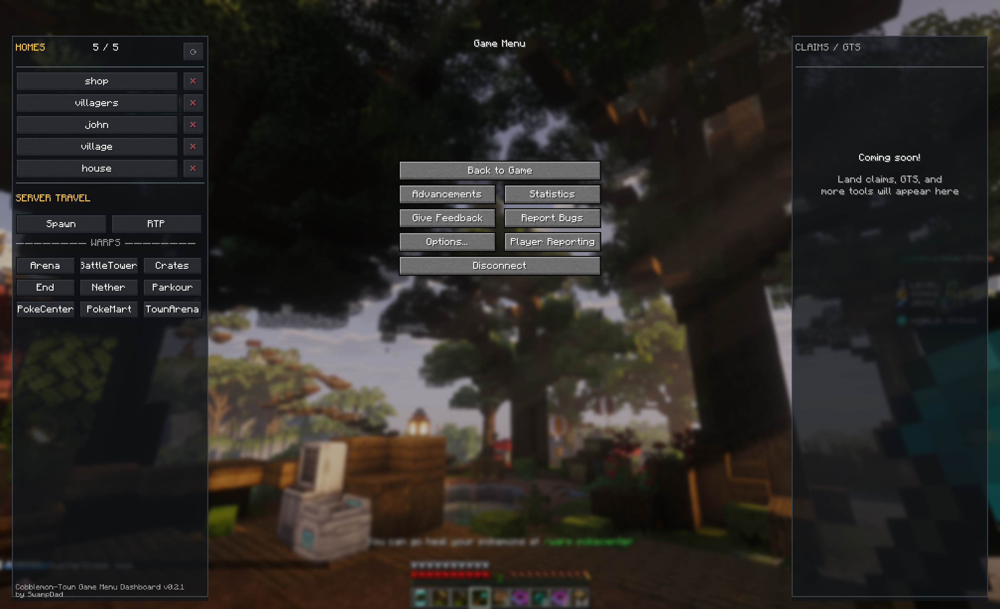

# Cobblemon-Town Game Menu Dashboard

Game Menu Dashboard is an independent, unofficial client-side Fabric mod. It is not
produced by or affiliated with Cobblemon Town, Cobblemon, or any server.

Version 0.2.1 adds a compact dashboard to Minecraft's Escape / Game Menu while leaving
all vanilla Game Menu controls unchanged.



*Game Menu Dashboard v0.2.1 on Cobblemon Town.*

## What it does

- Shows Homes in a five-row scrollable viewport with click-to-travel, a small reload
  control, named creation, and confirmed deletion.
- Adds fixed Server Travel buttons for Spawn, RTP, and the supported server Warps.
- Reserves optional visual territory for future Claims/GTS work without implementing
  either feature.

The dashboard sends only one ordinary command for a deliberate server action. It does
not automate chat input, chain commands, modify inventory, or require a server mod.

## Install

Download `game-menu-dashboard-0.2.1.jar` from the GitHub Release and place it in the
Minecraft instance's `mods` folder. Remove older Dashboard versions first, then restart
Minecraft.

Compatibility: Minecraft 1.21.1, Fabric Loader >= 0.18.0, Fabric API >= 0.116.7+1.21.1,
and Java 21 or newer.

## Build

```sh
./gradlew test build
```

Release only the remapped runtime JAR from `build/libs/`, never a `-dev` JAR.

Licensed under the repository [MIT License](../LICENSE).
