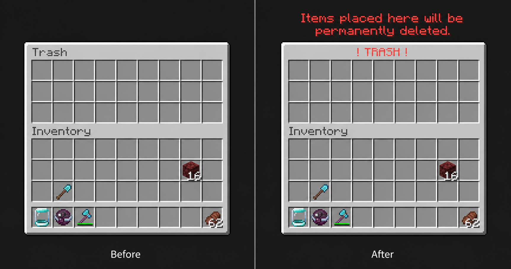

# Trash Warning

Trash Warning is a small client-side Fabric mod for Cobblemon Town's `/trash` screen.

The Trash inventory looks almost exactly like a normal chest, making it easy to mistake
for storage. The mod adds a clear red `! TRASH !` heading and permanent-deletion warning
while leaving the normal Minecraft container and its behavior unchanged.

Trash Warning is independent and is not an official Cobblemon Town mod or server
feature.



*Before and after on Cobblemon Town.*

## Install the mod JAR

The current installable mod is **`trash-warning-0.1.3.jar`**. A GitHub source ZIP or a
repository checkout is not a Minecraft mod JAR.

For ordinary use, download the JAR directly from the
[Trash Warning 0.1.3 GitHub Release](https://github.com/wguDataNinja/cobblemon-town-client-mods/releases/tag/trash-warning-v0.1.3).
Until then, or when developing, build from source:

```powershell
# Windows, from trash-warning\
.\gradlew.bat clean build
```

```sh
# macOS/Linux, from trash-warning/
./gradlew clean build
```

The one file to put in the client's `mods` folder is:

`build/libs/trash-warning-0.1.3.jar`

Do not use a `-dev` JAR from `build/devlibs/`, and do not use a source archive.

## Why it exists

Cobblemon Town's `/trash` opens as a normal-looking 9×3 inventory. That's not much
visual distinction for a container that permanently deletes items left inside it.

Trash Warning simply makes the screen obvious. It doesn't add confirmations, change
inventory behavior, or modify the server.

## How it recognizes Trash

A chest shouldn't get a warning just because somebody named it `Trash`.

To avoid that, all of these observed details must match:

- `GenericContainerScreen`
- `GenericContainerScreenHandler`
- 3 rows and 63 slots
- the observed 27 container + 36 player slot layout
- title exactly `Trash`
- structured title exactly `{"text":"Trash","color":"dark_gray"}`

Anything else is left alone.

Live testing confirms:

- normal chest → no warning
- anvil-renamed `Trash` chest → no warning
- Cobblemon Town `/trash` → warning

### Known limitation

Another server/plugin container with the **exact same client-visible fingerprint**
cannot be distinguished from `/trash`.

If that happens, it would receive the warning too. Nothing about the container itself
would change.

## How it works

Fabric's `ScreenEvents.AFTER_INIT` is used to check the screen once when it opens. The
result is cached for that screen.

`ScreenEvents.afterRender` then adds the title and warning when the cached screen is
Trash.

Minecraft still handles the container, slots, items, tooltips, clicks, and keyboard
input normally.

There are no mixins, packet or command hooks, inventory modification, gameplay
automation, network requests, telemetry, or server-side components.

## Compatibility

- Minecraft `1.21.1`
- Fabric Loader `>=0.18.0`
- Fabric API `>=0.116.7+1.21.1`
- Java 21

The mod is client-only. The server does not need it.

Version 0.1.3 has been built and live-tested with Minecraft 1.21.1, Fabric Loader
0.18.4, Fabric API 0.116.7+1.21.1, and Cobblemon 1.7.3 in a disposable,
baseline-aligned Cobblemon Town test clone. Broader configuration testing remains
separate.

If a future server update changes the `/trash` fingerprint, the mod fails closed and
displays nothing.

## Requirements

Install the supported Fabric Loader and Fabric API. No configuration or server
installation is required.

## Testing

Automated tests cover the Trash fingerprint and rejection of incorrect titles, classes,
dimensions, slot counts, and slot layouts.

Live tests have confirmed:

- ordinary chest unchanged
- anvil-renamed `Trash` chest unchanged
- `/trash` recognized correctly
- normal container behavior remains unchanged

New environments should also be checked at different GUI scales and with any installed
UI/overlay mods.

## Source review

The runtime code is intentionally small:

- `TrashWarningClient` — Fabric event registration
- `TrashScreenClassifier` — reads the screen fingerprint
- `TrashFingerprint` — matching rules
- `TrashWarningRenderer` — draws the warning

There are no mixins, networking, gameplay automation, or inventory manipulation.

These files are the primary runtime audit surface. A complete review can also inspect
the Gradle configuration, Fabric metadata, dependencies, and built JAR.

Licensed under [MIT](../LICENSE).
